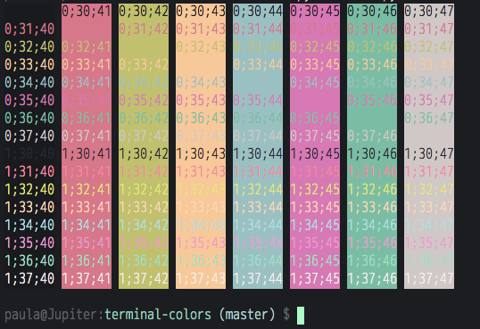
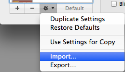

# Coffee Sea
A color profile for OS X terminal

Colors are heavily inspired by Chris Kempson’s [base16](https://github.com/chriskempson/base16), and the font is 14pt [M+ 2m light](http://mplus-fonts.sourceforge.jp/mplus-outline-fonts/index-en.html).

## Install

Terminal > Preferences > Settings

Click the gear icon drop down > Import...

